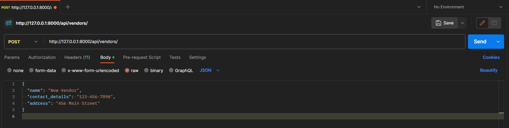

## Project Requirements

```
Python 3.10 or above
git bash CLI
Visual Studio Code - Code Editor
Postman software (optional)
```


## Project Setup : 

#### Open git bash and run the following commands

###### Clone the project
```
git clone git@github.com:nikhivishwaa/Vendor-Management-System.git
```

###### Change Directory
```
cd Vendor-Management-System/
``` 

###### Prepare Python virtual environment
```
python -m venv env
```

###### Open vscode by this command
```
code .
```


#### Start new terminal in vscode and run following commands

###### Activate venv if not acivated automatically
```
.\env\Scripts\activate
```

###### Download all Dependencies
```
pip install -r requirements.txt
```

###### Switch to the project
```
cd vemsys
```

##### Run commands for migrations
```
python manage.py makemigrations
```
```
python manage.py migrate
```


#### Run this commands to start Django server

```
python manage.py runserver
```

#### Admin Credentials to login in Django Admin Panel

username - `   admin       `<br>
password - `   root@8000   `<br>

###### Create new admin by following command

```
python manage.py createsuperuser
```

## Do the Following Setting in Your Postman to use API

### Step 1: Register Youself from Postman to get Authorization Token


###### Make a POST request with desired Parameters on the following URL
```
http://127.0.0.1:8000/api/register/
```

###### Copy the Token and Store it Safely for next step


### Step 2: Set the Headers of request


###### Add key -  `Authorization`  with Value

```
Token YOUR_AUTH_TOKEN_HERE
```

###### Specify Content Type `Content-Type`

```
application/json
```

##### Body of the request that contains JSON for POST, PUT and PATCH operation




### Now you can Use this API Easily with following endpoints

######  Methods  ` GET ` ,  ` POST `

```
http://127.0.0.1:8000/api/vendors/
```

######  Methods ` GET ` ,  ` PUT ` ,  ` DELETE `

```
http://127.0.0.1:8000/api/vendors/{vendor_code}/
```

######  Methods ` GET ` 

```
http://127.0.0.1:8000/api/vendors/{vendor_code}/performance/
```

######  Methods ` GET ` ,  ` POST `

```
http://127.0.0.1:8000/api/purchase_orders/
```

######  Methods ` GET ` ,  ` PUT ` ,  ` DELETE `

```
http://127.0.0.1:8000/api/purchase_orders/{po_number}/
```

######  Methods ` POST `

```
http://127.0.0.1:8000/api/purchase_orders/{po_number}/acknowledge/
```


## Other Options: Make request by JS on above API endpoints with authtoken


###### Define a function for reusability

```
function getdata(apiurl, token){
    fetch(apiUrl, {
      method: 'GET',
      headers: {
        'Authorization': `Token ${token}`,
        'Content-Type': 'application/json',
      },
    })
      .then(response => response.json())
      .then(data => console.log(data))
      .catch(error => console.error('Error:', error));
}
```

###### Get list of Vendors

```
const apiUrl = 'http://127.0.0.1:8000/api/vendors/';
const token = 'YOUR_AUTH_TOKEN_HERE';
getdata(apiUrl, token);
```

###### Retrieve vendor data

```
const vendor_code = 'YOUR_VENDOR_CODE';
const apiUrl = `http://127.0.0.1:8000/api/vendors/${vendor_code}/`;
const token = 'YOUR_AUTH_TOKEN_HERE';
getdata(apiUrl, token);
```


###### Retrieve vendor performance metrics data
```
const vendor_code = 'YOUR_VENDOR_CODE';
const apiUrl = `http://127.0.0.1:8000/api/vendors/${vendor_code}/performance/`;
const token = 'YOUR_AUTH_TOKEN_HERE';
getdata(apiUrl, token);
```